# Installing UHD Drivers For Windows 11 and GNU-Radio
This is a guide for installing USRPs' Drivers (UHD) in Windows 11 and making them work GNU Radio

## Table of Contents
1. [Python Installation](#python)
2. [UHD Drivers Installation](#uhd)
3. [UHD Imagews for GNU Radio](#uhd-images)

<a name="python"/>

## First, Installing Python:
Go to Microsoft Store
.png>)

Go to the latest version of Python.

.png>)

Install

.png>)

Open Command Line (CMD) and check if python is found

.png>)

Install "Requests" library which is required by UHD drivers.

.png>)

The First Step is done, congrats :)

<a name="uhd"/>
## Installing UHD Drivers
Go to the following link [https://files.ettus.com/binaries/uhd/latest_release/](https://files.ettus.com/binaries/uhd/latest_release/)

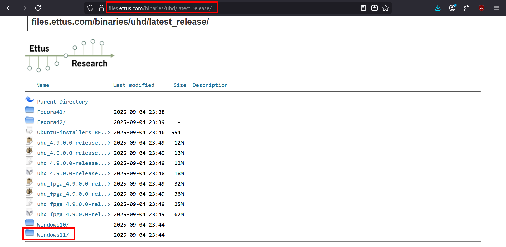

Enter Windows 11 Folder and Download Drivers


Open EXE Installer

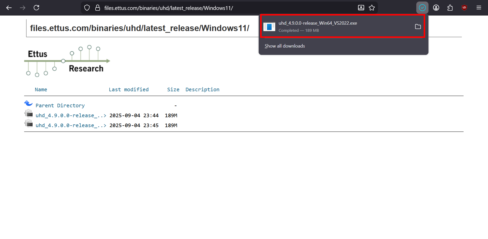

Follow the installation procedure

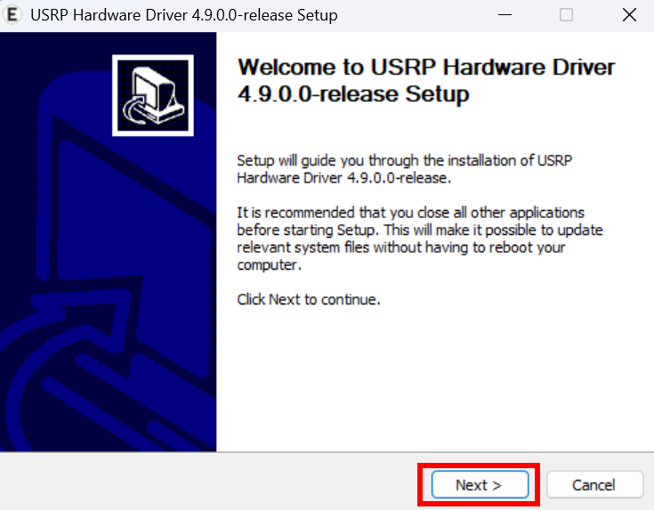
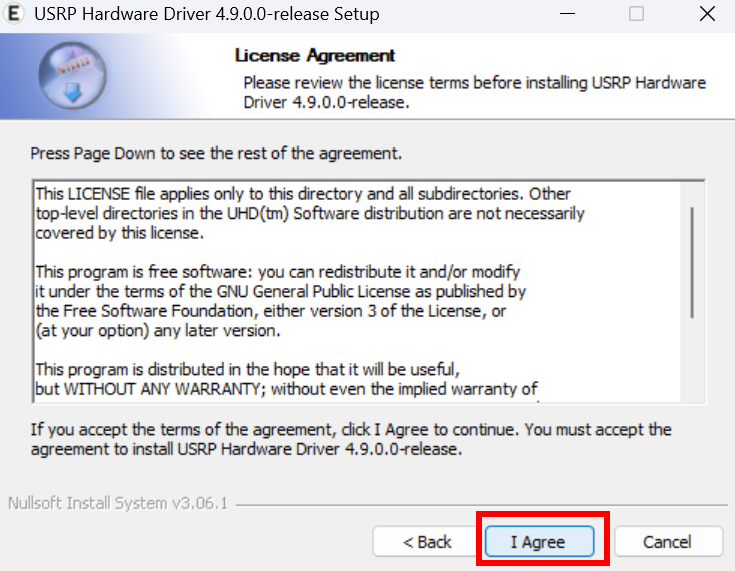
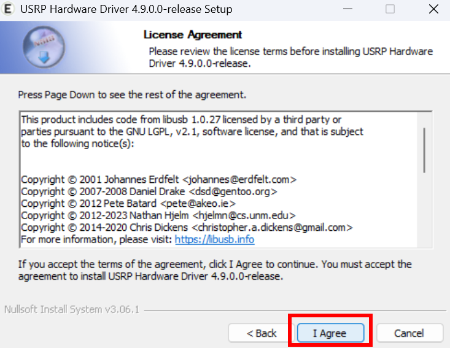
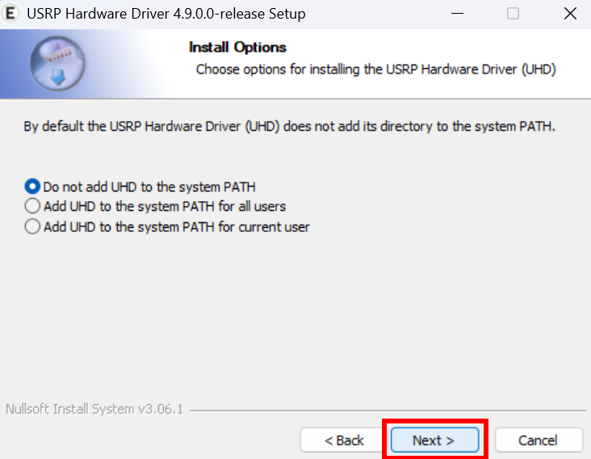
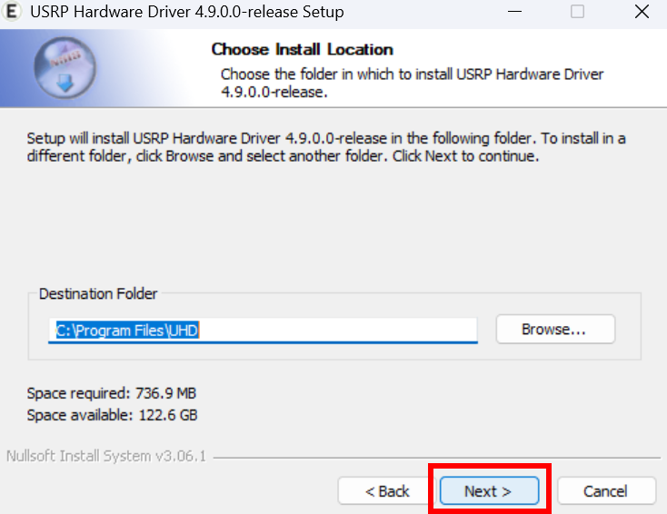
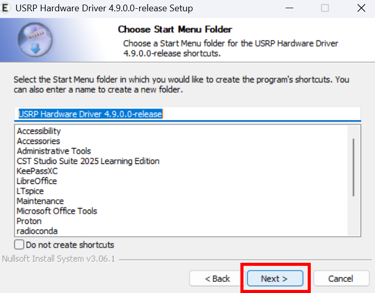
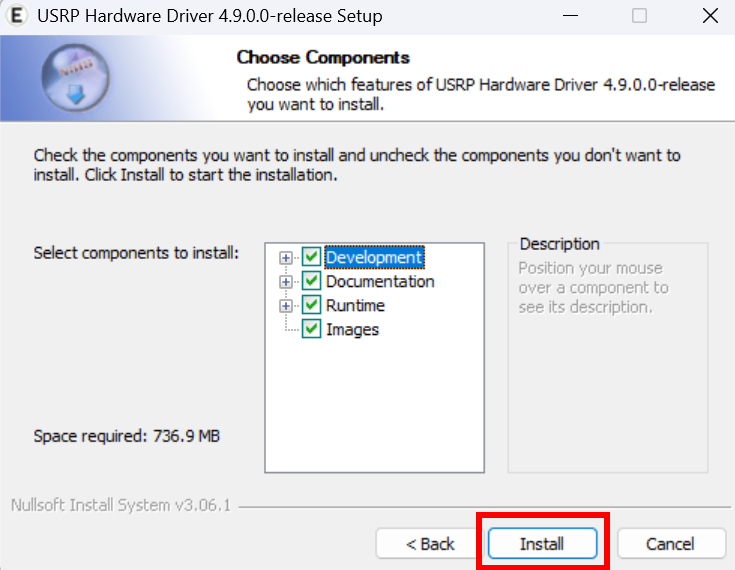

And, You have finished installing the UHD Drivers required by USRPs.

<a name="uhd-images"/>
## (Additonal): Installing UHD Images for GNU Radio
due to some problem with GNU Radio, it wont download the UHD Images automaticlly, so the following is a guide to download them by running a simple python script

First, Run Command Line (CMD) in Adminstrator Mode:

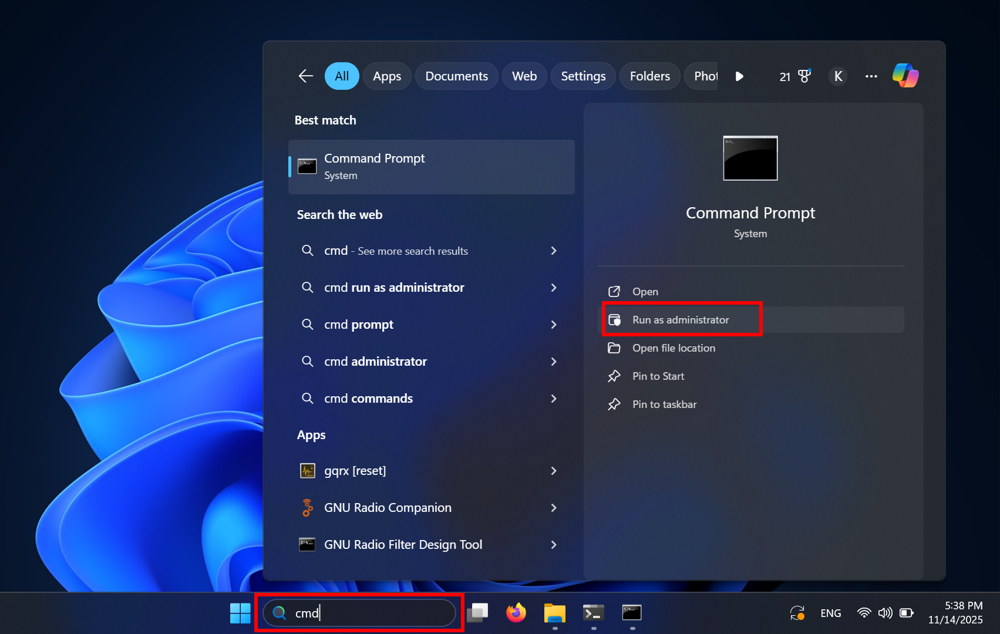

Go to the GNU Radio UHD files directory using the following command
```console
cd C:\Users\%USERNAME%\radioconda\Library\lib\uhd\utils
```
This should work if you have GNU Radio installed and its in the default place and your windows default drive is the C drive.

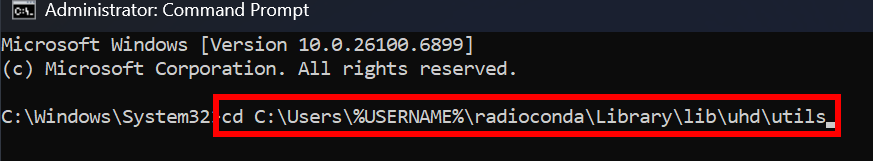

Run the following Command to start the uhd_images_downloader.py
``` console
python uhd_images_downloader.py
```


If everything worked, the following output should be displayed:

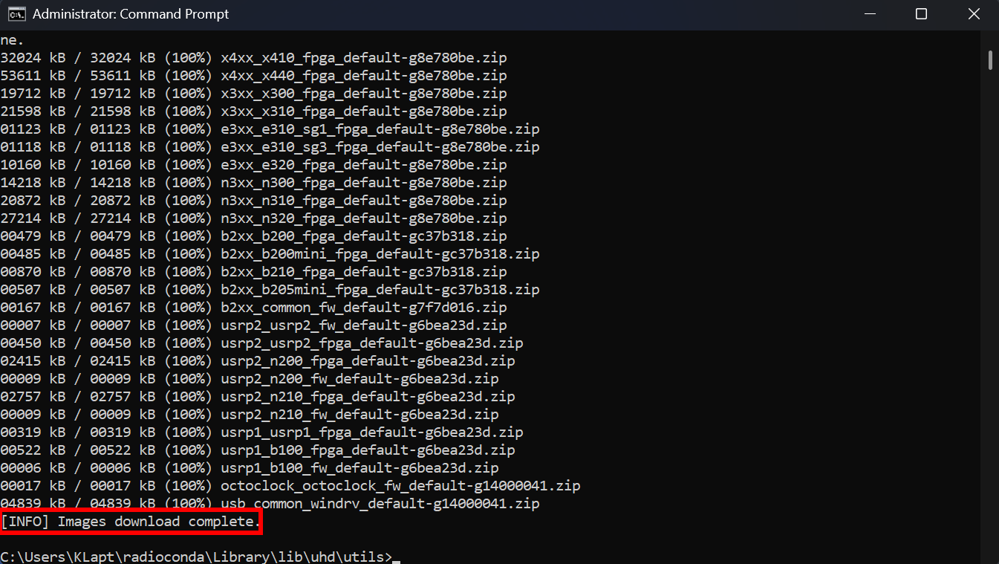

IT could be downloaded already, so you may see something like the following:
``` console
C:\Users\%USERNAME%\radioconda\Library\lib\uhd\utils>python uhd_images_downloader.py
[INFO] Using base URL: https://files.ettus.com/binaries/cache/
[INFO] Images destination: C:\Users\KLapt\radioconda\Library\share\uhd\images
[INFO] Target x4xx_x410_fpga_default is up to date.
[INFO] Target x4xx_x440_fpga_default is up to date.
[INFO] Target x3xx_x300_fpga_default is up to date.
[INFO] Target x3xx_x310_fpga_default is up to date.
[INFO] Target e3xx_e310_sg1_fpga_default is up to date.
[INFO] Target e3xx_e310_sg3_fpga_default is up to date.
[INFO] Target e3xx_e320_fpga_default is up to date.
[INFO] Target n3xx_n300_fpga_default is up to date.
[INFO] Target n3xx_n310_fpga_default is up to date.
[INFO] Target n3xx_n320_fpga_default is up to date.
[INFO] Target b2xx_b200_fpga_default is up to date.
[INFO] Target b2xx_b200mini_fpga_default is up to date.
[INFO] Target b2xx_b210_fpga_default is up to date.
[INFO] Target b2xx_b205mini_fpga_default is up to date.
[INFO] Target b2xx_common_fw_default is up to date.
[INFO] Target usrp2_usrp2_fw_default is up to date.
[INFO] Target usrp2_usrp2_fpga_default is up to date.
[INFO] Target usrp2_n200_fpga_default is up to date.
[INFO] Target usrp2_n200_fw_default is up to date.
[INFO] Target usrp2_n210_fpga_default is up to date.
[INFO] Target usrp2_n210_fw_default is up to date.
[INFO] Target usrp1_usrp1_fpga_default is up to date.
[INFO] Target usrp1_b100_fpga_default is up to date.
[INFO] Target usrp1_b100_fw_default is up to date.
[INFO] Target octoclock_octoclock_fw_default is up to date.
[INFO] Target usb_common_windrv_default is up to date.
```

You are Done :), Enjoy Learning !
